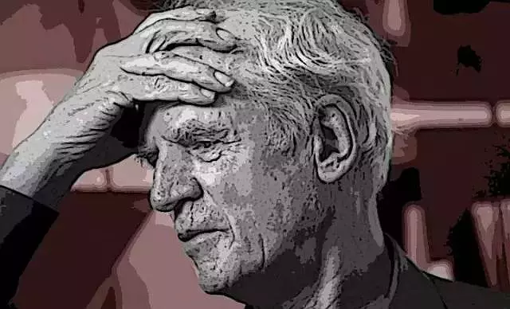

> “人类永远极易陷入对死亡和暴力的痴迷，这从根本上说体现了我们作为‘宗教人’（homo religiosus）的本质。”

**编者按**：

Categorical violence是当今西方学术和文化界广泛讨论的议题，汉语世界一般译作“类型化暴力”或“范畴性暴力”，似乎难以体现这个概念的要旨。当代加拿大著名哲学家查尔斯·泰勒（Charles Taylor）一直对宗教与暴力的问题有着深切的关注。他曾有过一个惊人的论断，他说：“人类永远极易陷入对死亡和暴力的痴迷，这从根本上说体现了我们作为‘宗教人’（homo religiosus）的本质。”2008年，泰勒获得了享有盛誉的京都奖（Kyoto Prize），在获奖演说中他坦言：“关于宗教的、意识形态的或民族主义的暴力之基础的问题，极大地占据了我的关注。”到目前为止，泰勒关于暴力问题最为重要的文本是一篇题为《关于暴力之根源的札记：亘古的与现代》的长文，其中的核心概念即categorical violence，在研读翻译的过程中，译者认为这个概念不妨译作“族类暴力”，“族”与“类”都有该词词根category（范畴、类别）的含义，又使人联想到“非我族类，其心必异”，从而在一定程度上体现出这种暴力的特殊性质。下面是泰勒这篇长文的第一小节《暴力之谜》，为适应网络媒介，做了一定编译处理。

暴力有很多种，家庭暴力、犯罪暴力，不胜枚举。在这里，我只想关注一种，即族类暴力（categorical violence），也就是**针对整个类别的他人而实施的暴力**，因而其中也就会有暴力实施者可能完全不认识、从未有所接触的人。我想到的是针对一个替罪羊式的少数群体而施加的暴力，或是像种族清洗、种族灭绝这样的现象。而且，不消说，2001年的“911事件”立刻就会浮现心头。

当今是一个文明化的时代，但不文明的族类暴力却反复上演。这个问题的根源是什么？它是人类早期残忍行径的“孑遗”，亦或者就是一种倒退？而且，族类暴力真正令人诧异的地方，不仅在于人们确实会出于非理性而去屠戮别人，更在于

> i 这种暴力往往是“过度的”，超出了最初的目标，带来了更多的受害者，牵涉到更多的暴行。
>
> ii 过程中可能会用到某种关于净化（purification）的语言，正如人们在“种族清洗”一词中看到的那样。
>
> iii 含有一种仪式性的要素。

后两个特征会使人想到原始宗教中某些牺牲的暴力模式，这进而强化了此种暴力是一种倒退的看法。

_
“你瞅啥？”
_

我们是否能以生物学的方式来理解暴力？还是说，我们必须诉诸超生物学（metabiological）？这里的“meta-”前缀，是取其在“形而上学”（metaphysics）一词中所用的原初意义——形而上学又被称作后物理学，或超物理学。

所以，“超生物学”（metabiological）中的“meta”应该这样理解：生物性是人与其它动物共享的东西，共需的食物、居所、性；还有一些东西，只有人类会寻求，但是它们所满足的需要，在动物那里也有类似的对应物。但是，当我们面临意义的需要之时，就进入了超生物学的领域。在这里我们不再能够以生物学的方式（动物也有的对应物）说出涉及到的是什么，也不能说清哪些种类的事物（比如一种目的感、重要感，或者某一种生活所具有价值感，诸如此类）可以回应这种需要。

**性与暴力都可以做出社会生物学的解释**。我们可以想象，我们的祖先不得不发展出战斗的习性，与外来者作战，保卫自己的部落。必要时，还有杀戮，否则他们就生存不下去。对于男女结为成对配偶，也可以做出这类解释：这可以确保更多的后代存活。也许，我们会认为这种解释可以解释今天的现象，比如为了战争进行的民族主义动员——以民族生存的名义可以为对敌人的无情攻击做出辩护。也可以用这种方式来解释爱情与婚姻在当今所有社会中的重要性。可以肯定，进化对人类的现状做出了巨大的贡献。社会生物学的真正问题不过是它能在多大程度上做出解释。

_
Sex and Violence
_

然而，即便是社会生物学家肯定也清楚知道，我们围绕着爱与战争，已创造出了详尽的超生物学的意义架构。我们知道什么是真正的、深刻的爱，也知道什么是正义的战争。问题是：	这些自我理解的架构能够解释我们在这些领域中的行为吗？尤其要指出，这些架构是文化性的，它们在不同社会中各有不同。为了把握我们为什么会做一些事情，理解这些文化性的变量是否要紧？还是说，我们在这些领域中的行动的主要特征都可以按照我们共同的进化遗产得到恰当的解释？

没有人能否认，这些各不相同的文化性意义架构对于理解不同社会的道德观和宗教观具有至关重要的作用。每个文化为了控制性与暴力所具有的强大而有破坏性的力量都努力采取了不同的方式，也许为了理解这些方式，我们必须来到超生物学的层面。那么，是不是说这些控制方式是文化性的，而暴力的力量本身可以纯粹以生物学的方式来理解？

但这种区分方式很容易与将族类暴力视为“倒退”的看法取得一致：文化在进化，带来了越来越高的道德行为标准，我们现在适应的人权观念，一定程度上比先前文明的人权观更先进。但我们也许可以说古老的冲动仍旧潜伏着，等待合适的条件爆发。我们甚至还可以给这种看法再加上一种弗洛伊德式的曲折：文明进步带来了更严格的标准，这些标准对于暴力行为施加更重的禁令。以前宣泄的出口，像是狂欢节、暴乱、公开的行刑仪式、斗牛、猎狐等等，如今都被打上了野蛮的标签，全被禁止。这增强了族类暴力爆发时的释放感，带来了汹涌的兴奋感。

若是依据这种解释上的“劳动分工”，我们就可以认为暴力本身可以纯粹在生物学层面上得到解释，作为某种在人类生活中保持原样的东西，即便文化一直在“进步”。我们注意到行凶者通常是男性，尤其是年轻的男性，这为我们提供了一种与荷尔蒙相关的解释。那么，暴力是否要全归结于睾酮激素？但是，这看起来极不充分。

_
Crucifixion
_

并不是说身体化学不是关键因素，而是说它从未单独在人类生活中起作用，它只有透过事物对我们所具有意义才能发生作用。用荷尔蒙解释暴力，并未阐明为什么人们更易于感受到某些意义。它至多只能解释暴力这一事件本身。比如为什么男性在人际关系中比女性更暴力。况且，即便是这一点也是可以质疑的，因为詹姆斯·吉列根（James Gilligan）等人的研究发现已经指出，遭遇羞辱是个人暴力的重要起因。

面对族类暴力时，我们看到超生物学的因素往往起到了决定性的作用。是的，男性青年往往被族类暴力所吸引，但是我们也看到他们在失业时更易受到诱惑。失业中的男青年四处晃荡，看不到未来。这正是巴勒斯坦的难民营中的情形。正是他们的生活嵌入其中的那些意义架构，为他们提供了充满活力的目的感，激发着他们，将重要性赋予他们的生活。而且，正是这些架构指定了谁是同胞，谁是仇敌。

然后还有我在上文中略有些委婉地说到的，往往与这种暴力相伴的“过度”，这可以给予行凶者一种“高度兴奋”，既允许也引诱我们超越一切限制。美国记者克里斯·赫奇斯（Chris Hedges）这位一贯敏锐的观察者在近来的一本书中写到：

“对于其他人类生命宛如上帝般的强势与战争这毒品结合在一起，就像是性爱的狂喜，使我们的感觉支配我们的身体。杀戮解放了我们内在的汹涌暗流，驱策我们进入毁灭的狂暴。死者的尸体在和平时期会被人以一种尊敬对待，而在战争时期却被施以虐待。它们成了一件件表演艺术品。在波斯尼亚，尸首被钉在谷仓的大门边上，斫去脑袋，或者像扔掉的衣服一般挂在篱笆上。尸体被抛进河里，被人驱赶到仓库里，射杀、残害，抛在路边。孩子们可以在大街上走过，看着尸体，然后走开。”

_
Exhumations in Srebrenica, 1996
_

我们不禁想将这一些解释为“倒退”，解释为纯粹的生物性的野蛮。但是，我认为这是一个危险的幻觉。而即便这是真实的，也并不意味着这里的古代可以按依据生物性而非文化性得到解释。

我们也可能不禁想要从如下这个事实出发解释这种高度兴奋和狂野放纵：这些潜在的冲动在现代文明中受到了严重的约束，甚至压抑，这就导致了我们可以释放之时的那种突然喷涌而出的能量。当我们注意到暴力的释放如何也可以引发一种不受约束的性欲，使行凶者得到一种爱欲的光晕之时，上述的观点可能就会进一步被强化。

但是，即便我们回到“野蛮时代”，在现代文明的严厉禁止出现之前，性与暴力这两种冲动从最早的时代开始，就与超生物学的意义相互交织。通过圣婚，或是庙妓这样的仪式，性就与神圣关联了起来。以战争形式出现的族类暴力，来自人类历史的幽深之处。 约翰·基根（John Keegan）认为它最初在绝大多数情况下也是仪式化的。这限制了伤害的扩大。（讽刺之处在于，因为“理性化的”行动，“进步”意味着更大的破坏。）此外还有漫长而多样的以人做牺牲的历史。

_
庙妓，又称圣妓，是指在庙宇里生活，为朝拜者提供性服务的人
_

所以，不仅是我们控制不受约束的性欲和暴力欲的努力必须以超生物学的方式来理解，这些“冲动”本身也必须通过意义架构来把握，正是这些意义架构赋予了它们在我们生活中的形态。

我在此的目标将是试图辨别出这种意义中的其中一部分。过度、净化、仪式似乎指向了“原始”时代的历史，宗教的历史，实际上是“原始”宗教。那么，这些现象是否纯粹是“倒退”？

既是，也不是。**有着一种与这一古老历史之间的延续性，但是这更像是旧故事在一个新版本中的改编，或是旧旋律转写到了新的乐谱上**。

**参考资料**

**Taylor, Charles. "Notes on the Sources of Violence: Perennial and Modern." Dilemmas and Connections: Selected Essays. Belknap Press of Harvard University Press, 2011. 188-213.**

**完整译文见 [https://www.douban.com/note/614254023](https://www.douban.com/note/614254023)**