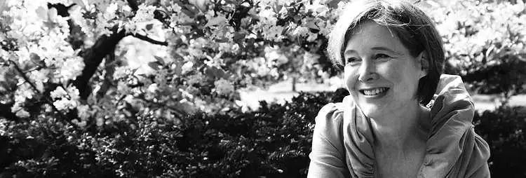
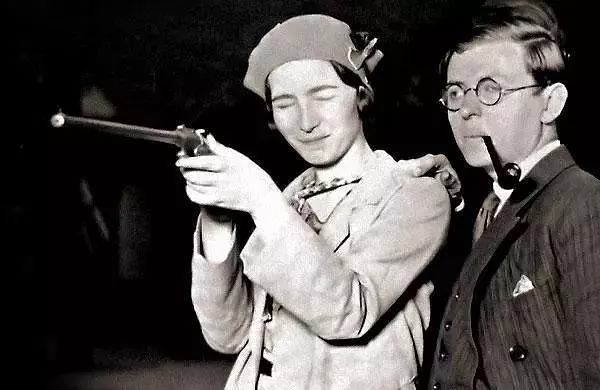
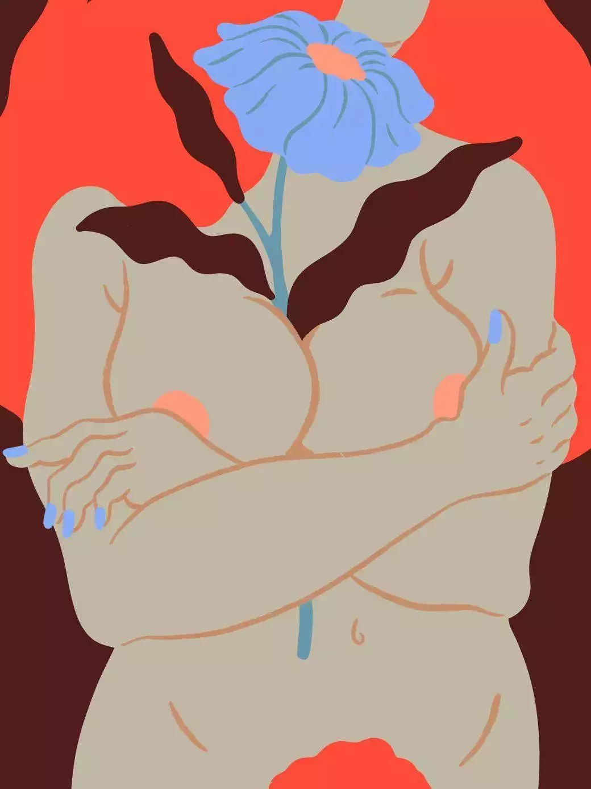

# 1

我的第一本书在春天出版，它网罗了好几段情事，详尽地描绘了一系列充盈却不得释放的情欲。发行后，一间男士读书俱乐部邀我去做宣讲。得知这一消息，我为我生活的城镇还有这样一间俱乐部而激动，欣然应允。想不到南方的男性读者居然也有阅读严肃文学的习惯！

这场会面在一名读书会成员的家中进行，当时大概有十几位男士到场。我们漫无目的地闲走，尽量平常地交谈。吃好吃的墨西哥菜，还喝了好些西班牙葡萄酒，最终围坐到咖啡桌边旁的沙发和椅子旁上。我简述了大家较为关心的我的“创作过程”，并随后开放了提问环节。

但没有人说话，男士们移入皮革包裹的沙发之中，用手指快速滑动那些书页。外面很热，持续有人进出，细微刺耳的开关门声不断从身后袭来。“也许没人真正在读我的书吧，”我想。

Work by Sara Andreasson

终于，一位坐我对面的男士，将他手中的书掷向桌子的一旁。“好吧，”他忿忿说道，“我来说，其实我们大家都更想听听看：你丈夫到底如何看待你的作品？”

我忘记自己说了什么，也许只是笑，“我丈夫是我的第一读者，他百分之百地支持我。”在之后的几个月里，相同的问题重复出现于周身的熟人与陌生人当中，我也逐渐习惯于反复说出这些话。然而萦绕于我脑海中的却是：我丈夫对我作品的看法与之有什么关系？

假若我真是个写不正当性关系的男性小说家，你会问，我的妻子如何看待我的作品吗？

# 2

不含糊地说，“你的丈夫如何看待你的作品”是个诡计。在此询问之下，真正的问题是：作为创作者的你，是否和你书中的女主角做过同样之事？如果是，你如何会将它们写出来？难道你的丈夫不因此感到受伤吗？难道你不因此感到羞耻吗？

女性作家伍尔夫(Virginia Woolf,1882-1941)

**对于作家的真实生活与她的虚构作品之间的关系，读者有好奇心很自然。**但艺术家们如何创作？我不太认可说，这种对小说是否具有自传成分的询问背后存在一种赞美：假如读者觉得我一定和书中人物有过同样的经历，可能说明在某种程度上，我写得有理有据。考虑到小说主人公与我——一个住在南部有孩子的已婚妇女所具有的相似点，我理解读者会多么肯定地觉得我的小说和生活有种全然彻底的一对一关联。

女性作家杜拉斯(Marguerite Donnadieu,1914-1996)

我无法将这种询问视为称赞。相反认为，他们似乎对我作为一个作家——尤其是一个描写女性性与禁忌的作家的想象力表示了怀疑。当我写一位与癌症抗争的女性，她与丈夫和孩子住在南部时，没有一个读者问我，我是否得了癌症。当我写到一位母亲，她丈夫是一个镇定剂上瘾者，她因此差点放弃宗教信仰时，没有一个读者问我，我丈夫是否也是镇定剂上瘾者，我是否也差点因此放弃我的宗教信仰。

**讨论身为作者的你，比讨论作品本身更重要和有趣。我们的目光从艺术作品转向艺术家个人的速度之快，充满意味。**当沃尔特·胡珀（Walter Hooper）询问刘易斯（C. S. Lewis，英国作家，卡耐基文学奖获得者）是否曾想过他的书“帮他赢得了名誉”，刘易斯回答，“各位最好不要想这个问题”，当你开始询问我的个人生活，你已然错过了重点。我带给世界的作品——那才是无价之宝，如果我们非要讨论一些重要的事情，应该从它最开始的地方。

女性艺术家弗里达(Frida Kahlo,1907-1954)

我在你的书里认出了一些东西——你居住的城镇，你有几个孩子——以致于其它关于你的一切都应该是真的。然而**大多数作者对书写自己真正做了什么并不感兴趣，我们大多利用写作去探索一些从未经历之事，这像是一个前往未经之路的机会**。在写作之中，去开解那些在我们实际生活中永远不必解决的谜团。艺术的想象如此强有力，这便是我拥有的一切，是我职业写作的方式，我坚定不移地守护着它们。**当读者觉得作者只是单纯在记录她所经历的生活时，他正在贬损艺术家最基本的才能。**

女性作家安·帕奇特(Ann Patchett)

小说始于微小的事实，而后被转化为庞大的谎言，最终显露更普遍的真相。正如安·帕奇特（Ann Patchett，美国小说家，前期写作非虚构小说）的母亲说的，“这一切从未发生，但这一切都是真的。”

**我阅读时的感受必定是你写作时的感受。**若你在阅读时感到羞耻、兴奋或不适，棒极了。这就是我写作的原因：白色书页之上的黑色字符穿越时空，去触达另一个灵魂。但你怎么知道我写作时感受到了同样的事情（更何况我丈夫的看法）？让作者感到“忏悔”或“情欲感染”的文章段落，可能是我在创作过程中觉得最为疏离，最令我心智愉悦的地方。毋庸置疑，那是艺术想象力自在漫游的地方。

一个写非虚构小说的朋友告诉我，人们赞美她散文有一种“脆弱气质”时，她也有同样的感受。“太好笑了，你竟然认为我脆弱”，她想说，“我写的时候，只觉得自己是个狠角色！”

**一个写与性相关题材的男性很寻常，而写作同样内容的女性却被怀疑有违道德。**

在此，我们不如抓住其关键症结。“你丈夫怎样看你的作品？”或“你作品中有多少自传成分？”这些问题的实际意味着，“你是否做过这些性反叛的事？”这一切假定与判断都是性别化的。

女性作家波伏娃(Simone de Beauvoir,1908-1986)和她的伴侣萨特(Jean-Paul Sartre,1905-1980)

2018年，我们依然要为这些观念付出代价：男性思考这些不当性行为理所当然的，但女性——好吧，女性则必须更加端庄？如果我们生活在一个私人和职业生活不被利用或羞辱的社会，我们当然可以不为我们的性想象而羞愧， 或不将质疑女性的想象能力作为起点。

# 3

男性时常会神化或贬低女艺术家，事实上女性也会如此。我最近一次媒体旅行时，一位没见过的女士和我说，我最新小说《火诫》，有某种“回忆录”和“忏悔录”的意味，它混淆了生活与艺术的边界。是，在塑造这个人物时，我使用了忏悔的口吻，我解释说。角色试图通过日记和祈祷以减轻她的内疚、渴望和悲伤，或者这就是她提到的“回忆录”意味？但我的小说不是我的个人回忆录，那些日记也并非是我的。

 Work by Sara Andreasson

以及昨晚，我接受了一个本地创作小组的访谈，第一个问题来自一位女性：“你将作品中涉及的许多地点都设在当地……那么可否说你写的一切都颇具自传成分？”我说，今天我正准备用一篇文章来回答“你丈夫对你写的小说怎么看”这个问题。“其实这就是我想问的！”她回答。

女士们、先生们，不用再问这样的问题了——女作家无需经历她们所书写之事，便可进行创作；她们想象力超群，打破禁忌、跨越性别。她们的丈夫觉得能娶到她们简直酷到爆炸好吗！

**原文作者简介：**

**Jamie Quatro是小说《火诫》(Fire Sermon)和短篇故事集《我想告诉你更多》(I Want to Show You More)的作者，现居美国佐治亚州。**

**译者：王美苏**

**编辑：沈浪**

**校对：吴琪**

**图片：王美苏**

**排版：来红兵**

**设计：陈芝**

