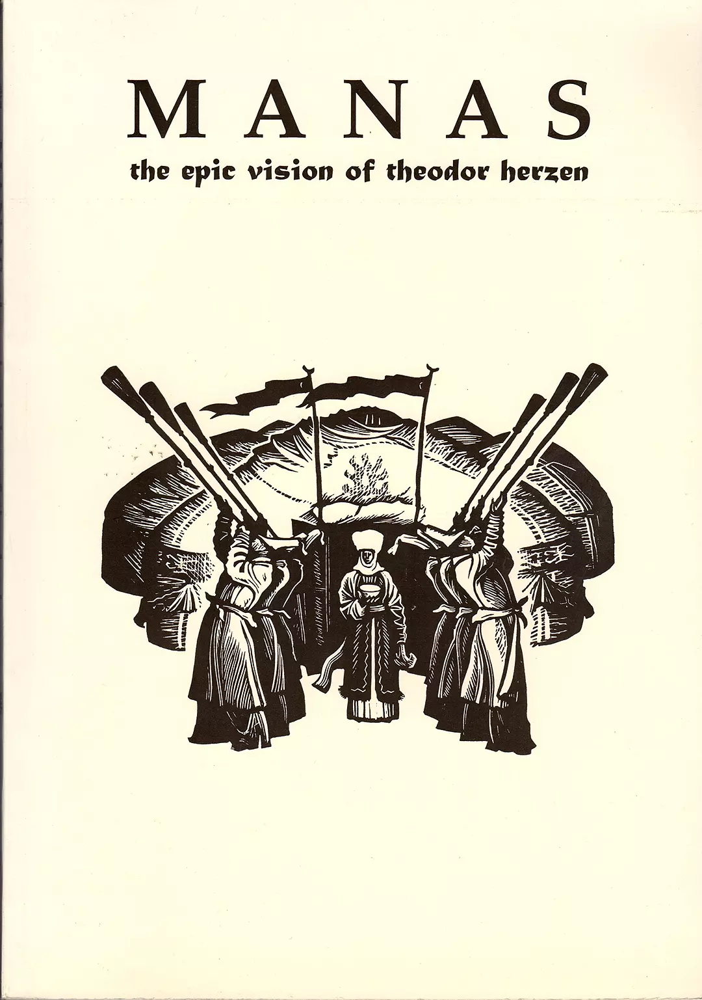
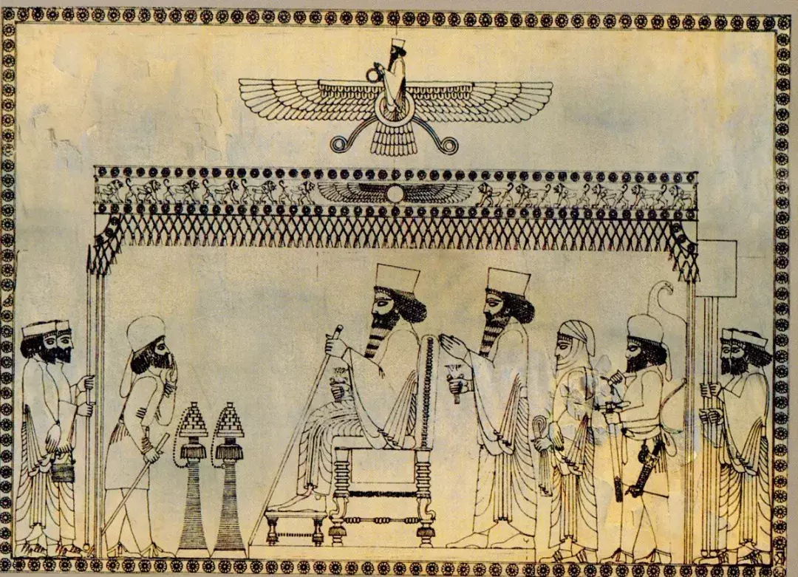
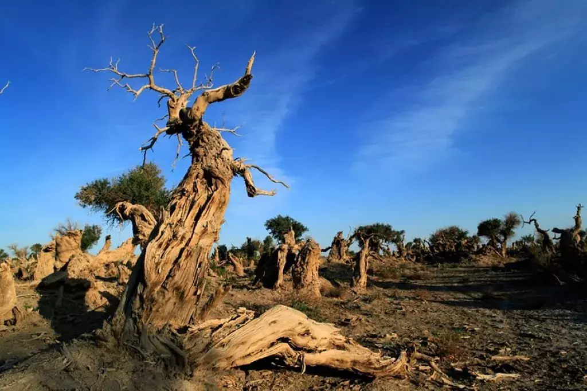

title: '哈萨克神话中的创世纪与图腾崇拜'
preview: '这些神话有一些来自中亚游牧民族的历史共性，有一些来自哈萨克族自身的文化，还有一些来自伊斯兰教的影响。'
author: z
cover: '-/images/kazakhs-myth/1.webp'
date: 2018-06-15 18:00:00 +0800
editor: '马特'
design: '子川' 
proof-reader: '小典'
type-setting: '齐慧'
tags:
  - 神话
  - 传统文化
  - 宗教
  
---

## 1.

在更多的时候，我们其实是把历史遗忘在了神话里，正如托尔金在他的《魔戒》中写道：“History became legend, legend became myth.”神话中总是隐藏着历史的影子。无论是荷马的《奥德赛》还是赫西俄德的《神谱》，我们都能从中找到一点儿真实世界的痕迹。神话是一个民族童年的记忆，它记录了文明刚刚诞生时的朴素和纯真。但有的民族没有那么幸运，他们的文化历经磨难传承到今天。在历史的层层叠叠下，他们甚至失去了自己的神话。

刚来乌鲁木齐的时候，我想写一篇城市奇幻的短篇小说。于是我拉着维吾尔族同学，向他们讨教一些当地的神话或是传说。他们拧着头想了半天，纷纷表示自己小时候并没有听过神话故事，顶多了解一些英雄长诗。后来我了解到，在《乌古斯汗》和《玛纳斯》这样的民族史诗里偶尔会有一些神话人物的痕迹，但也不多，当地的民族传说更多是一些奇人异事，少有神仙鬼怪。

<small style="color:grey">《玛纳斯》是柯尔克孜族的英雄史诗，为全世界第二长的史诗，仅次于藏族史诗《格萨尔王传》。该史诗叙述了柯尔克孜族传说中的英雄和首领玛纳斯及其子孙共八代人领导族人反抗异族（契丹和瓦剌）的掠夺与奴役，为争取自由而斗争的故事。</small>

这种现象其实很容易理解。中亚地区从公元九世纪开始逐渐伊斯兰化。伊斯兰教在中亚传播的过程中，对于当地的偶像崇拜以及原始宗教进行了全方面的压制，当地神话的传承在这一过程中也受到了很大的破坏。

我不甘心于就此止步，开始和几个同样感兴趣的维吾尔族朋友在图书馆四处寻找，结果维吾尔族神话没找到几篇，却收集到了一些哈萨克族的神话。在这一过程中我又结识了几个哈萨克族朋友，一番交流后，我惊奇地发现，由于哈萨克族长期保持着游牧传统，他们的神话居然仍有传承，这种传承十分微弱，几近遗失。我对这些神话稍作整理，选出了其中浪漫而独特的几则，介绍给大家。

## 2. 哈萨克族的创世神话——迦萨甘

有关创世的神话在所有民族的神话中都占据着最重要的地位，因为它代表了一个民族的世界观。**哈萨克族的创世神话名为《迦萨甘创世》，它讲述了一个名为“迦萨甘”的神创造世间万物的故事。迦萨甘即为“Jasaγan”，哈萨克语中“造物主”的意思**。这个神话极为浪漫绚丽，并且充满了想象力。

迦萨甘在混沌中创造了天地。一开始，天地都很小，天如圆镜，地如马蹄。后来天地慢慢长大，各自分为七层。而后天地一片黑暗，极为寒冷，迦萨甘用自身的光热创造了日月，用来照亮这个寒冷的世界。

为了支撑起大地，迦萨甘找来一头青牛，让它用犄角将大地顶起来。不过这青牛脾气很犟，只愿意用一个犄角顶住大地，而且时常更换，于是地上多有地震。迦萨甘找来一些高山作为钉子，将大地固定在青牛身上。

地需要支撑，天同样也需要。迦萨甘在大地的中央种植了一棵神杨树，这棵杨树人眼看不到，高耸入云，支撑天空，而后迦萨甘将日月安置在天空上。地面太空旷，迦萨甘用泥土捏了两个小人，然后把灵气从小人的嘴巴里吹了进去，两个小人便活了过来，这就是人类的始祖。男的名字叫阿达姆阿塔（Adam Ata），女的名字叫阿达姆阿娜（Adam Ana）。熟悉突厥语的朋友们一定知道，Adam在突厥语中是“人”的意思，这两个人名的意思其实就是“人类之父”与“人类之母”。

<small style="color:grey">根据神话，神杨树是最初的生命形式，认为是宇宙的中心和连接不同世界的门。</small>

迦萨甘又创造了飞禽走兽和草木鱼虫，大地上开始生机勃勃。这时，邪恶力量也开始显现。这股邪恶力量就是“黑暗”，黑暗给人类带来恐慌和寒冷，疾病和灾难也接踵而至。迦萨甘派太阳和月亮去驱赶黑暗，在《迦萨甘创世》中，太阳和月亮是一对情侣，他们在天空中互相凝望，产生了爱情。在与黑暗战斗的过程中，他们失散了，但是他们牢记使命，不停驱赶黑暗，于是两人再无聚首的机会，只能在天空中无尽轮回。当他们难以抑制思念之情的时候，天上便会下起雨雪，那是他们的眼泪。

《迦萨甘创世》是上世纪六十年代哈萨克学者尼合麦德整理收集的，在这个故事中可以看到很多有意思的东西。比如对于“神杨树”的描述，这是一种在中亚地区很常见的树崇拜，一直流传到今天。而抟土造人的那部分，难免让我们联想起女娲造人的故事。事实上，远古时期的各民族交流远比我们想象的要频繁，早在母系氏族时期，生活在中原地区的农耕部落便与中亚和西北地区的游牧民族（如羌人）有过交流，那么抟土造人的神话或许在那时便开始流传了。

这个神话的最后一个部分则更有意思，它反复强调“光明”与“黑暗”的对立，这让人不禁联想到哈萨克历史上曾经信仰过的“琐罗亚斯德教”。琐罗亚斯德教在国内又被称为“祆教”，是“明教”或说“摩尼教”的源头。这个宗教吸收了基督教、佛教和拜火教的很多教义，并且尤为强调光明与黑暗的二元对立，单看“明教”的名字便可知道。

<small style="color:grey">记录袄教祭祀仪式的画作</small>

## 3. 哈萨克族的起源——白天鹅

**除了创世神话，有的民族往往还会创造出“族源神话”，以标志本民族的不同**，哈萨克族也有这种神话，这便是“天鹅女”的故事。

这个故事我找到过几个不同的版本。第一个版本是讲在远古时候，有一个勇士战斗中负伤，被困在戈壁上，生命垂危。这时一只天鹅飞来把他引到清泉边，勇士用泉水解渴后，伤口痊愈。鹅变成一个美丽的姑娘，并与勇士结婚，他们生了一个儿子，起名“哈萨克”。哈萨克娶妻后生了3个儿子，其后代繁衍，成为哈萨克族的3个“玉兹”（哈萨克族的3大部落）。哈萨克人自古把天鹅视为圣鸟而加以崇拜，禁止捕杀。

另一个版本则稍有不同，故事中的勇士变成了牧羊人。故事中牧羊人用悠扬的冬不拉征服了天鹅女，同时也被天鹅女的优雅美丽所征服。后来牧羊人迷失在荒漠之中，天鹅女助他逃出，两人生儿育女，诞生了哈萨克族。这两个故事区别不大，都是具有优秀才华和品质的人在绝境中被天鹅女拯救的故事。

<small style="color:grey">白天鹅</small>

我的哈萨克族朋友中有的人并没有听过天鹅女的故事，但却承认白天鹅确实是哈萨克族的吉祥物。据说在过去，有哈萨克巫师会扮成天鹅的模样举行仪式。此外，也有朋友告诉我，“哈萨克”与“白天鹅”在哈萨克语中也有联系。哈萨克发音为“Kaz-ahk”，而白天鹅发音为“ah-hu”，将白天鹅的发音倒过来念则与哈萨克相似。不过这一点我稍微存疑，我念了半天也没觉得相似。

哈萨克族的民族概念最终形成于十五世纪，当时哈萨克族分为三个部落，分别为大玉兹、中玉兹和小玉兹。这三个部落因血源关系而分化，其中小玉兹被沙俄吞并，其余两部则归顺准噶尔部。清朝平定准噶尔叛乱后，这两个部落便归顺清朝。可见，三个玉兹的形成时间并非很久远，这说明神话传说在口口相传的过程中，不断被当时的历史事件所影响。历史的痕迹便这样镌刻在了这些神话上。

这些故事由一些汉族学者通过采访哈萨克老人得来，由于语言不通，很多细节也未加以注意。另有一位哈萨克朋友向我指出，“玉兹”（yuz）在哈萨克语中是“百人”的意思，更倾向于一种作战单位而不是部落，类似满族的“牛录”。玉兹据说是俄皇叶卡捷琳娜发明的，用以分化控制善战的哈萨克族。

## 4. 神树和苍狼

与其他民族一样，中亚地区游牧民族的早期信仰也是一种万物有灵的图腾崇拜。我最先学会的几个维吾尔语单词，是我猜测的四种图腾，分别是胡杨（Koktirak）、狼（Bora）、熊（Eyik）和鹰（Burkut）。后来我找到了一篇介绍维吾尔族早期图腾的论文，里面恰好介绍了这四种图腾，我猜得一个不差。

<small style="color:grey">胡杨树</small>

**胡杨是一种神奇的树，我还在内地的时候，就听到过它的很多传说，它在远古时期作为图腾，我丝毫不意外。胡杨的突厥语发音是托克提拉克（Koktirak），我在伊犁做民居调研的时候，曾经不止一次见到“托克拉克村”这样的名字，可见当地居民至今仍对胡杨树心存敬意**。而在南疆，另一种叫做巴旦木（Badam）的树被视作神树，受到所有人的尊崇和爱护。

对于神树的崇拜，在很多民族中都可以见到。比如蒙古族认为自己的祖先是从树中长出的，而满族则崇拜柳树和柳叶，弗雷泽在著名的神话学著作《金枝》中曾拿出整整两章的篇幅来论述欧洲的树神崇拜。人类远古时期的生活与森林密不可分，大树开花结果，孕育生命，如不遭横祸，很多大树可以生千年而不灭。如此看来，对于树神的崇拜是很容易理解的。

**哈萨克族的神话中，神树的地位也非常崇高，它立于世界正中心，并且起到承托天空的作用**。此外，这棵树还是生命之树，据说，树上茂密的叶子都是世间人类的灵魂，每一个叶子对应着人世间的一个人。新生命诞生的时候，神树会长出一片新叶子；当人的生命逝去的时候，树上的叶子便会枯萎脱落。更浪漫的是，脱落的叶子落下时会触碰到其他树叶。这代表着如果有人辞世，他的亲人会感应到。

**除了神树崇拜，苍狼崇拜也是游牧民族的一大特征。游牧民族在草原中最常遇到的就是凶猛而又团结的狼群，在狩猎采集时代，人们和狼群一样在莽莽草原中围猎。很多民族将狼作为图腾，并常常以“草原上的狼群”作为典故来教育孩童**。哈萨克族的沙甫拉西部就是以狼作为标志，甚至在旗帜上还镶着狼的图像，并且在战斗中以“狼”作为口号。狼在哈萨克族的叙事长诗中，狼也经常作为神物出现，赐予主人公力量或保佑其平安。如长诗《贾尼别克》中，主人公的力量便是在年轻时由两头苍狼赐予的。

<small style="color:grey">2004年，姜戎《狼图腾》一书曾畅销大江南北，故事背景即为蒙古人以狼为图腾，但这一点在学界一直有巨大争议。</small>

## 5. 神秘的数字“四十”

在收集新疆各个民族的神话故事的时候，有一个现象让我格外感兴趣，那就是中亚民族对“四十”这个数字的喜爱。

**哈萨克神话中有“四十个希尔坦圣人”的故事，四十个希尔坦圣人常常出现在各种神话和史诗故事中，为英雄排忧解难。另外，哈萨克族有的四大长诗，被称为“四个四十”**。这四个长诗分别是《克里木的四十位英雄》、《拜合提亚尔的四十支系》、《鹦鹉故事四十章》和《四十个大臣》，这些故事的情节也常常与四十有关。维吾尔族长诗《乌古斯汗》里，乌古斯汗四十天长大，举行宴会时使用四十个桌子和四十条板凳。柯尔克孜族长诗《玛纳斯》中，主人公带领的是四十位英雄。

更有意思的是，甚至有的民族的族名里就带着“四十”这个词。柯尔克孜族（国外称吉尔吉斯人）的族源神话为《四十个姑娘》，这个神话有多个变体，但大致内容是讲王宫中有四十个宫女，在河水中沐浴而感应怀孕。王原打算将所有宫女处死，但后经劝说改为流放，四十个姑娘在深山中将孩子生下，繁衍而成柯尔克孜族。

当然，柯尔克孜族的族源也有其他说法。比如《玛纳斯》中讲到有四十个部落归附汗玛玛依，这些部落后来繁衍壮大，成为柯尔克孜族。此外还另有诸多传说，但都与“四十”这个数字有关。柯尔克孜的发音为“Kirkiz”，其中“Kirk”的意思就是“四十”，“Kiz”的译法有多种，但确有“姑娘”的意思。柯尔克孜这一族名可以直译为“四十个姑娘”，如此可见“四十”这个数字在当地影响之大。

我查阅了一些有关阿尔泰语的语言学资料，有历史比较语言学的成果表明，很多阿尔泰语系的民族语言中的数字“四”是有着相同的语源的。也就是说，“四”这个数字概念，在阿尔泰语诸民族分化前就已经出现，并占据着重要的地位。

其实我们可以有一个大胆的推测，早期游牧民族在生活中最常接触的便是四蹄的牲畜，或许这种游牧生活使他们对于“四”这个数字有了特殊的感情。由于阿尔泰民族最早也是使用十进制，语言中的整十倍数也多以个位为词根。“四十”这个数字的独特地位，或许便是从这里而来的吧。

**近代哈萨克族的主要信仰是伊斯兰教，伊斯兰文化对哈萨克族产生了极为深远的影响。这种影响在各种传说中也得到体现，其中最为典型的是一则创世神话**。

在这则神话中，安拉创造了阿达姆阿塔（Adam Ata）作为第一个男性，后来又创造了第一个女性哈瓦娜（Evana）作为他的配偶。哈瓦娜是用阿达姆阿塔的肋骨做成。最初，他们住在天堂，因受艾扎则尔（后变为魔）的诱惑，违反安拉的禁令，故被逐出天堂。

后来在洪水淹没世界，人类濒临灭迹时，他们是受安拉之命留在喀兹库尔山唯一的一对未遭洪水淹没的夫妇。洪水过后，阿达姆阿塔和哈瓦娜每年生一男一女，这些兄弟姐妹互相婚配（但同年所生的孪生兄妹不可婚配）。阿达姆阿塔享年千岁而后故世，一年后哈瓦娜也去世。

这则神话显然是《圣经》和《古兰经》中创世神话的翻版，而且将上帝造人和诺亚方舟这两个故事融合在了一起。这个故事经过了一定的哈萨克化处理，但仍旧保留了主干情节。大家这时或许注意到了，突厥语的人（Adam）其实就是亚当（Adam），而哈瓦娜（Evana）可看做夏娃（Eve）的变体。

<small style="color:grey">《伊甸园亚当的堕落》，彼得·保罗·鲁本斯和老扬·勃鲁盖尔绘制</small>

近代中亚和新疆地区的诸多突厥语民族对于伊斯兰教的依赖程度有高有低。如维吾尔族这样定居较早的民族，他们对伊斯兰教的信仰深切坚固。但对于哈萨克族和柯尔孜克族这样的游牧民族，他们的传说和神话则有相当一部分得以幸免。

**在这些民族中，伊斯兰的宗教传说和英雄史诗有时会结合起来**。我们在上面提到过的“四十个希尔坦圣人”，他们经常在各种史诗中出现，而又有故事传说他们原来居住在阿拉伯世界，后来受到安拉的派遣，来到中亚以拯救万民。在哈萨克长诗中常出现“三件宝物”的传说。三件宝物即穆萨的手杖、苏莱曼的戒指和达伍德的褡裢，传说是由三位圣人受安拉之命带来中亚。

由此可见，在哈萨克的神话传说中，既可以看到伊斯兰传说的哈萨克化，亦可看到哈萨克故事伊斯兰化的痕迹。事实上，伊斯兰文化在中世纪是一种极为开放包容的文化，非常擅长与各地文化进行结合。这在波斯、土耳其和中亚地区都有反映。

## 6. 结语

就这样，我们在历史中寻访到了神话，而后又在神话中看到了历史，这个过程虽然艰辛，但却足够有意义。当我将这些神话讲给我的哈萨克和维吾尔朋友的时候，我在他们的眼中看到了一种独特的光亮。

这让我想起电影《天使艾米丽》里面的情节。艾米丽在洗手间发现了一个男孩收藏的童年宝物，她寻访整个城市，将装满童年记忆的盒子送还给了它的主人。看到盒子，已经五十多岁的男人眼眶瞬间湿润，儿时的记忆如潮水般涌上心头。

一个历经磨难的民族重新发现自己的神话，就如同一个沧桑的老人偶然发现了儿时的珍藏。打开盒子的那一瞬间，已经足以抚慰。

---

部分神话的来源及参考文献：

* 姜崇伦 主编 《哈萨克族历史与文化》新疆人民出版社 1998.6

* 谷德明 主编 《中国少数民族神话》 中国民间文艺出版社 1987

* 那木吉拉 《阿尔泰神话研究回眸》民族出版社 2011.1

* 那木吉拉《中国阿尔泰语系诸民族神话比较研究》学习出版社 2010.5

* 满都呼 主编 《中国阿尔泰语系诸民族神话故事》 民族出版社 1997

* 张越、姚宝瑄编《新疆民族神话故事选》新疆人民出版社 1989

* 迪木拉提·奥马尔 《阿尔泰语系诸民族萨满教研究》新疆人民出版社 1995

* 耿世民《乌古斯可汗的传说》新疆人民出版社 1980.4

* 居素普·玛玛依 演唱 《玛纳斯》新疆人民出版社 1991.1