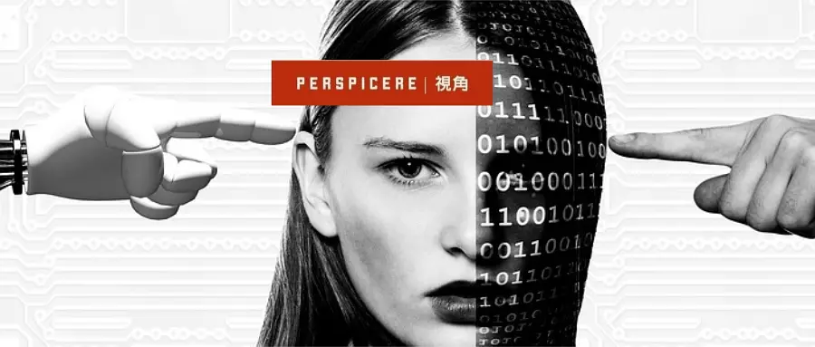
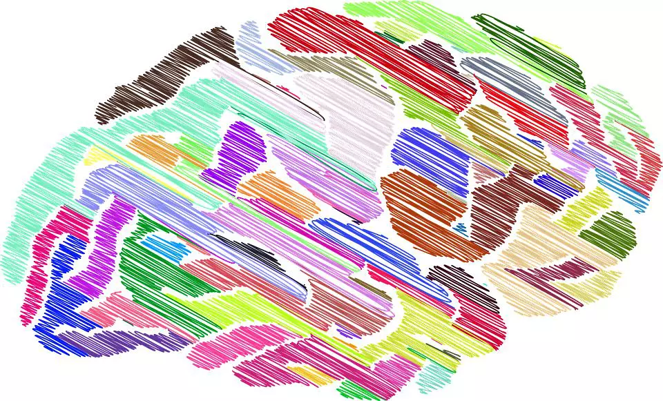
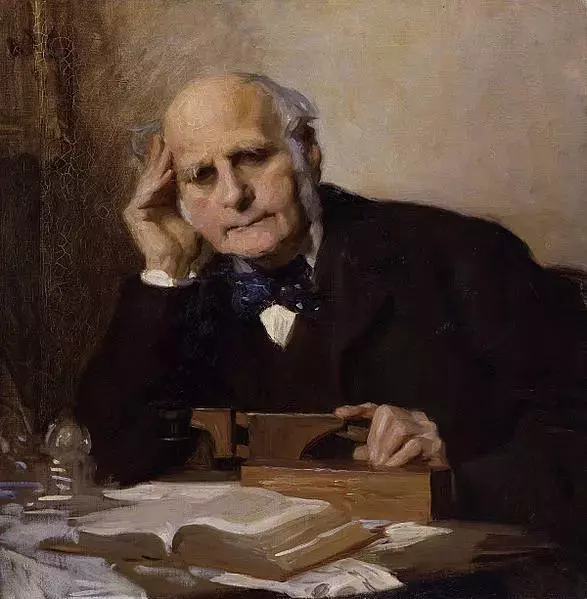
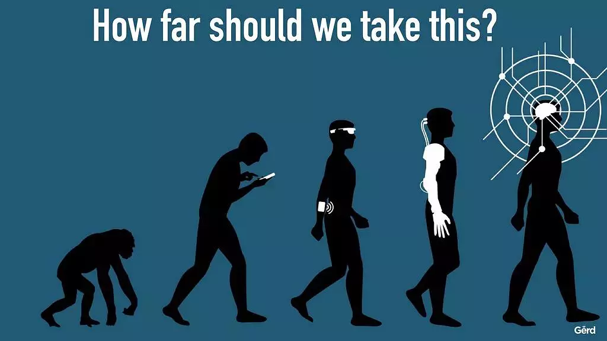

title: '我们为什么害怕人工智能'
preview: '在IQ/EQ等各种量化商数被高度崇拜的时代，我们是否有必要理解智力这一概念本身所蕴含的那些不为人知的黑暗过去，令未来各种展现人类“聪明”的探索，富有一点智慧的微光？'
author: winnie
cover: '../images/why-afraid-of-ai/5.webp'
date: 2018-07-07 18:00:00 +0800
editor: '武权'
design: '童画,陈芝'
proof-reader: '小典,一枚读书匠'
type-setting: '付安琪'
tags:
  - 人工智能
  - 自我
  - 技术与社会

---

我成长于20世纪下半叶的英国。彼时，“智力”的概念处于社会议题的中心，人们激烈地辩论有关智力的话题，渴望并且想方设法来衡量它。成千上万的十一岁的孩子被带进考场，参加名为“11+”的智力测试。短短几个小时决定了他们的人生轨迹：谁会进入语法学校，上大学，成为专业人员；谁会进入技校，学一门手艺谋生；谁会在中学接受基本的训导，出卖体力糊口余生。

测量血压和鞋码的历史都很悠久，可当我参加决定终生事业的智力测验时，量化智力的历史不过百年。即便如此，智力对人生地位的决定论自古有之。从柏拉图的哲学到特蕾莎梅的政纲，智识串联起西方思想的历史。评价某人是否“聪明”（intelligent），从来不只是在客观描述他的思维能力，而是判定了此人被许可的行动界域——达不到某种标准，便不能做特定的事情。换言之，**智力与政治息息相关**。

有时候，这种智力排序是可以理解的。你去看病，肯定不希望碰上个蠢医生。要是知道一座大桥是个傻子工程师修的，你大概不敢上去走一遭。当然，要是碰上个没脑子的总统，个中滋味真是妙不可言。**然而，智力的决定作用有两面性。在决定一个人可以做什么的同时，智商（或其欠缺）还决定了别人能对你做什么**。看看西方历史，其中写满了被认为低等智力者的悲惨故事——被殖民、被绝育甚至被屠杀（甚至被吃掉，如果我们把动物也算进去的话）。

关于智识的古老叙事，在人工智能爆炸发展的今天翻开了新篇章。近年来，人工智能突飞猛进，许多专家相信目前已有的突破会引爆未来。权威评论者恐慌又激动，频频推特各种终结者之类的话语参照。但古老的问题还在这里，要理解为何我们关心这个问题，以及我们究竟在恐惧什么，就必须把智力当做一个政治概念——特别是**作为支配和统治依据的智识黑暗史**。

英美哲学语境中，智识这个概念并不常见，在德语和古希腊语中也没有确切的对应。但这不等于哲学家对智识本身不感兴趣。恰恰相反，他们迷恋智识，更确切地说是其中一部分——**理性**。近代心理学科的发展，使得“智力”在大众和政治话语中原有的理性本意颇为过时。无论学者给出的有关智识的定义多么宽泛，理性都是其核心。因此，在探讨智识在历史中扮演的角色时，我同样会考察理性。

关于智识的论述可以追溯到柏拉图。他在所有论著中赋予**思想（thinking）**以重要地位，（借苏格拉底之口）强调“未经省察的生活不值得一过”。在那个沉溺于神话和神秘主义的时代，柏拉图开创性地宣布，运用理性（今天，我们也会理解为**运用智识**）可获得现实背后的真理。由此，柏拉图在《理想国》中断言，“哲人王”才是理想的统治者：因为只有哲学家，才能辨清世间万物的秩序。智识精英统治的概念发端于此。

在当时，这种观点极富颠覆性。始于雅典的民主政治实验创造了人民当家作主的传统。但要算作“人民”的一员，只需成年男性公民身份即可，聪不聪明并不重要。而在其他城邦，统治阶级要么是世袭贵族（贵族制），要么是接受神谕的人（神权政治），要么是最强壮的人（专制）。

> 
在西方哲学诞生的初期，智识与受过教育的欧洲男性就画上了等号。

知识分子们对哲人王的构想趋之若鹜，其中包括他的学生亚里士多德。作为一位务实、善于归纳分类的思想家，亚里士多德确立了理性的首要位置，并以此为依据，建构出在他看来自然的社会等级秩序（social hierarchy） 。 在《政治学》中，亚里士多德说：“**人分为治人和治于人两类，不仅必要，而且妥当：从降生之日起，一些人适于臣服，而其他人适于统治。”统治者的独特，在于他具备“理性的要素**。”最大程度满足这一条件的是受教育的男性，因此女性自然处在被统治地位，那些身体“劳碌”不已的人则是“天生的奴才”。没有智力的动物更是处在等级阶梯的更下层，“被人类管着最好不过”。

在西方哲学诞生的初期，智识就与受过教育的欧洲男性就画上了等号。这成为了对女性、下层人民、“未开化”的民族和动物实行统治的依据。柏拉图肯虽然定智识霸权，并将其置入了一个不太优雅的乌托邦里，后一代的亚里士多德就使“智者治国”的信念变得自然而然，显而易见。

无须讳言，这种古老的思想在两千年后的今日应当受到质疑。澳大利亚当代哲学家、自然资源保护论者瓦尔·普鲁姆伍德（Val Plumwood）认为，古希腊先贤建立起的二元对立体系，仍在影响我们的思维。 **智慧/愚蠢，理性/感性，精神/身体，这些对立关系或明或暗地与男性/女性、文明/原始、人类/动物等其他对立范畴相联系。它们的价值取向并不中立，而是落入了一种更广义的二元论：统治/服从，主人/奴隶。这些二元对立令各种支配性关系（如父权制和奴隶制）表现为自然的秩序**。

如今认为，现代西方哲学始于笛卡尔：一个主要的二元论者。与亚里士多德不同，笛卡尔不认为从人到动物，智力递减。他认为，**认知（cognition）是人的正业**。中世纪近千年的基督教神学，将智力视为灵魂的属性和神性的启蒙火花，只属于那些以神的模样创造出来的幸运者。而**笛卡尔的反思则更进了一步：他将自然视作彻底无意识的存在，毫无内在价值可言**。因此，人对其他物种的压迫也就谈不上负罪感。

启蒙运动时期，智识乃人性之本的观点依然存在。自古以来最有影响力的道德哲学家，康德，便是其坚定拥趸。对他来说，运用理性的生物才有道德地位可言。理性的存在才能称之为“人”，其本身就是目的（ends in themselves），不必借助外物来证明；反过来，非理性的存在，只有作为手段（means）的相对价值，只能被称为“物”。我们可以对非理性的“物”为所欲为。在康德的哲学体系下，理性的存在拥有无限的价值和尊严，而非理性的存在则一无所有。尽管论证繁复，但康德得出了和亚里士多德一样的结论：**本来就有天然的主人和奴隶，而智识是区分他们的标准**。

> 
在某种程度上，智力测试的出现加剧而非矫正了对女性的压迫。

这一连串的逻辑成为了殖民主义的根本出发点：**非白色人种智力低劣，因此不配支配自己和相应的土地。摧毁他们的文化、夺取他们的土地——殖民行为合乎天理**。除此之外，由于智识是人之根本，智力低劣等于连人算不上，没有什么道德地位可言，因此奴役和屠杀也不足为虑。

同样的逻辑，妇女也被认为“轻浮”且“情绪化”，被剥夺了成为“理性人”的特权。在十九世纪的英国，法律对女性的保护不及家畜。因此，或许并不令人惊讶的是，智力测试的出现数十年来加剧而非矫正了对女性的压迫。

弗朗西斯·高尔顿（Francis Galton）爵士被视作心理统计学（psychometrics）——一门测量心灵的“科学”——的开创者。受到表弟达尔文《物种起源》的启发，高尔顿认为，智力具有遗传性，可通过人工选育得到提高。他决心找到科学方法，鉴别社会中智力最发达的人，鼓励他们相互通婚，多繁育后代。出于对人类整体的考虑，不聪明的个体就要被剥夺生育权。**智力测试和优生学因此相伴而生**。接下来的数十年中，大批欧洲和美国的妇女因这种智力测验不合格，被强制绝育。仅仅在加州，这个数字就达到了2万。

<small style="color:gray;">弗朗西斯·高尔顿</small>

由是，智识被用来为历史上的野蛮行径作辩护。然而，对理性支配的批评也从未消失。**从休谟到尼采，从弗洛伊德再到诸多后现代思想家，均向其发出了挑战：人并没有自以为的那么聪明，智慧也不是至高无上的优点**。

尽管影响广泛，智识精英主义只是社会价值取向的一种。想进入学校或特定的职业，例如英国的公务员系统，智力测验的优秀表现确实是敲门砖。其他领域则强调不同的特质，例如创造力和企业家精神。**尽管我们希望公仆们思维敏捷，但是我们不会总想去选举看起来最聪明的政客。（然而，民粹政客特朗普还是觉得需要强调“我们有一个史上IQ测试分数最高的内阁团队”）**

相比挑战智力等级秩序本身，许多批评则转向攻击帮助白人男性通往上流社会的不公平体制。拿我参加过的“11+”考试来说，这是一个有趣而又十分模糊的例子。尽管其初衷是从各阶级与宗教背景中找出资质异禀的年轻人，但事实上，大多数脱颖而出者，是家境优越的中产阶级白人。这样，考试反过来巩固了这些成员的优势和地位。

因此，当我们回顾智力究竟怎样在两千多年的历史中为特权和统治做辩护，人们对超级人工智能充满恐惧，便不足为怪了。

自《2001太空漫游》到《终结者》，作家们都痴迷于机器反戈人类的主题。现在我们终于明白为何了。我们既然认定社会的顶层应该属于最聪明者，那么自然会料想到在“脑力”成百上千倍澎沛于我们的机器人面前，变成无用废物的可能，被扫入金字塔的最底层。我们既然认定，聪明者可以正当地对不聪明者殖民。那么，我们自然害怕为超级人工智能所奴役。我们既然认定，我们文明的繁荣和强大全部得益于我们的智慧，那么我们自然会视高度发达的AI为存在性威胁。

> 
相比人工智能，天然愚蠢才是更大的威胁。

正如纽约学者和技术专家凯特·克劳福德（Kate Crawford）注意到的那样，关于特权的叙事某种程度上解释了为什么“西方白人男性普遍对恶意人工智能怀有恐惧”。**其他群体都经历了自封为优越者的漫长支配史，且仍然在反抗真正的压迫者。而白人男性，则习惯了处在等级秩序顶端的状态。假如新的实体出现，入侵了由他们把持并引以为傲的领域，他们会蒙受最大的损失**。

我并不想暗示，人们对恶意人工智能的焦虑是毫无根据的。人工智能技术的应用伴随着风险（也有巨大的潜在效益）。然而，**暂时还没有到像欧洲殖民者压迫澳洲土著那样担心人工智能压迫我们的时候**。

**值得担心的是，我们会用人工智能干什么，而不是人工智能会对我们干什么。更有可能发生的是，人们用聪明的机器来对付彼此，或者对它产生过度依赖**。如歌德笔下魔法师学徒的寓言所说，**假若人工智能作妖作乱，原因很可能不是它怀有恶意想要征服我们，而是我们下达了善意但未经检视的目标**。天生愚蠢，与人工智能相比，才是更大的威胁。

假如我们拥有对智力的不同看法，去思考怎样看待人工智能的崛起会是非常有趣的事情。柏拉图相信，哲人只有通过诱骗才能成为哲人王，因为相比于统治，哲人更爱沉思本身。**而其他传统，特别是东方哲学意义上的智者，则视权术的陷阱为虚妄，逍遥于纷繁世事之外**。

想象一下，假如我们遵从后者，不把自称有权统治的人当作聪明的人，而是把云游四方、沉思冥想，超然于俗欲之外，以宣扬和平、启迪众人视作智者的最高体现，我们是否还会惧怕机器人比我们聪明呢？

---

作者简介：Stephen Cave，剑桥大学未来智慧研究中心的资深学者。作为一位训练有素的哲学家，他曾经是一位外交官，且在哲学和科技领域著述颇丰。纽约时报，大西洋月刊和卫报都曾经刊登过他的文章。

原文链接：[Intelligence: a history | Aeon](https://aeon.co/essays/on-the-dark-history-of-intelligence-as-domination)