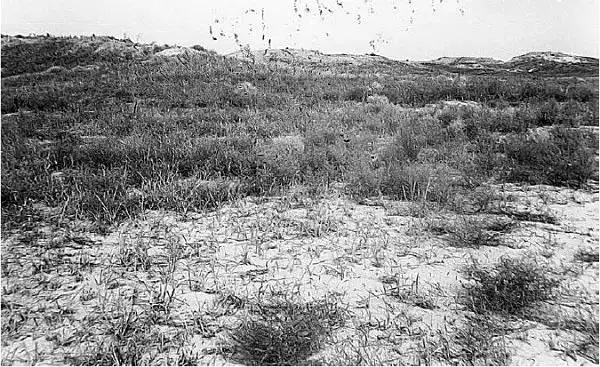
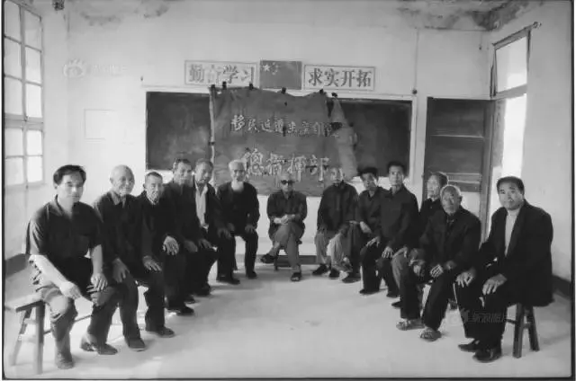
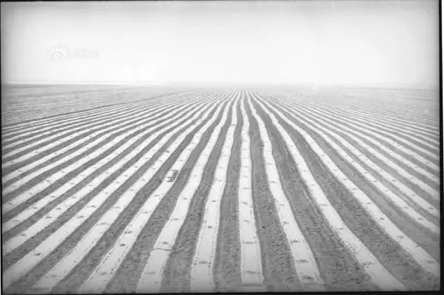

title: '饥饿与抗争：延续半个世纪的黄河大迁徙'
preview: '个人的命运无故被时代建设的洪流裹挟，显得那么微不足道，却又痛得真切。'
author: plus_tard
cover: '../images/yellow-river-migrate/1.webp'
date: 2018-04-08 18:00:00 +0800
editor: '武权'
design: '童画,陈芝'
proof-reader: '小典,一枚读书匠'
type-setting: '付安琪'
tags:
  - 历史
  - 移民
  - 个体与社会

---

**作者按：**

1933年，黄河大水，下游堤防溃决60多处，水灾波及下游5省30余县，灾民270余万。**为减少下游洪涝灾害的发生**，负责黄河治理工作的黄河水利委员会反复商讨，建议在地理条件优越的三门峡修建水库。正值建国初期，中国国力较弱，缺乏相关的水利工程建设经验，转而向苏联“求援”。

苏联方并不了解黄河的具体情况，为了加大建设规模，提出“**用淹没换取库容**”的三门峡水库建设方案。**这个移民近87万人，淹没良田325万亩**的工程，引发了长达几十年的争议，其间多次改建和调整，险些淤废，在之后很长一段时间，威胁着渭南人民的生存，导致了一个延续了近半个世纪的悲剧。

**本文主要由冷梦和谢朝平的报告文学作品整理而成**。

---

## 1. 响应号召

移民之前，三门峡附近这片黄、渭、洛冲积而成的三角洲沃土万顷，水渠纵横，人们生活富足，了无衣食之忧。

<small style="color:gray;">水库建造之前的三门峡地区 来源：南方日报出版社</small>

刚接到移民通知时，各乡县宣传人员不是全无顾虑，但在关系到国家大计的事情上，谁也不敢乱说，他们美化了移民后的生活，用“一人迁，万人安”“牺牲个人利益，支援国家建设！”的标语激励着村里的青年报名参与“移民先遣队”。政治激情燃烧的岁月，人们并没有意识到“移民”是件“苦差事”，**符合“先遣队”各类条件的人无不觉得参与先遣队是一件荣耀的事**。

1956年秋，经过层层选拔，首批远迁的先遣队出发了，他们并不真正知道将去到什么地方。周围喧闹的人群敲锣打鼓，卡车在路边排成一条长龙，陕西省义和村5208名青壮年披红戴花，扛着铺盖，带着农具，跟着车从陕西来到了宁夏贺兰平吉堡。

**刚到平吉堡，先遣队员便傻了眼**。平吉堡属于沙漠边缘地带，一眼望去荒滩上满是拳头大的石头，布满了杂草，与他们原先居住的那片沃土相差太远。迫于无奈，有些人在这片荒滩上用草搭上两个屋子，来年春天，在当地人用拖拉机浅浅翻了一遍的土地上播种下四十亩麦子，就此安了家；还有一部分人难以适应恶劣的生存环境，选择逃回家乡。

<small style="color:gray;">为配合库区修建，第一批志愿迁徙群众热烈响应移民政策，屈建忠、赵孟才、张西育是其中最早的先遣队员。 来源：南方日报出版社</small>

据1956年9月“部分移民返朝（指朝邑县）情况”报称：陕西渭南市朝邑县首批迁往宁夏的800人中，三天跑了361人，其中途中拦挡回260人，101人“现无下落”。

逃跑的人分南北两路回来，经过没日没夜的行走，已是面容憔悴，衣衫褴褛，回到家没多久，便不厌其烦地向村民诉说这一路上死里逃生的悲惨经历。由此，再动员就困难了许多，这些声泪俱下的现身说法比任何漂亮的诺言都更具说服力，**可移民任务已是板上钉钉，人们哪怕再不情愿也不得不继续西迁**。

## 2. 被迫西迁

由于水土不服，刚迁至宁夏没有多久，移民从陕西省义和村带去的二十头牛便死光了。不仅仅是牛，人也很难适应那里的环境。

此时，**中国正受困于全国性的大饥荒**，恶劣的环境威胁着人们最基本的生存。不幸的是，移民被分到的大多是荒地、旱地，粮食出产率极低，为了活命，他们只能捡当地人丢弃在地里的叶子煮水充饥。

因为贫困，移民也常常受到当地人的奚落。老移民回忆，在集镇上，他们攥着可怜的钱准备买萝卜，卖主一听对方是陕西口音，便忙用脚踩住布袋口，提高警惕、严加防范，害怕他们来偷来抢。

<small style="color:gray;">“1958-1962大饥荒”主题雕刻作品，《要有光》，胡杰，2015</small>

**不堪饥饿、歧视的折磨，各乡县移民自行组织起来，准备乘车从宁夏逃往陕西**。大规模的迁移行动惊动了陕西领导工作小组，他们把守住车站、码头，防止移民“逃回”陕西，搞出“返陕通行证”的名头，要求各部门不卖给移民车票。

**即使这样也无法动摇移民回陕的决心**。1958年冬，一大批人顺着道步行，经内蒙古沙漠迂回至山西太原、大同，过潼关，而后进入陕境。逃离的人有的不幸被逮住，采取**“软抵抗”的策略**，听凭干部送上火车，可到了半道上又调转方向逃了回来，如此往复。

还有相当一部分的青壮年，凭着一身力气跑到石嘴山煤矿出卖苦力。遇到县移民局和干部到煤矿去找人，矿上说：“是你们的人你们就领回去。”干部守在矿口拦堵，出来一群脸面摸得乌黑的人，根本辨认不清，只得打道回府，这部分移民也差不多成功地“潜伏”下来。

**当然，逃回原籍的人中也有成功者，其颠沛流离和生存之苦同样令人难以想象**，老移民王景仁便是一个典型。他几经辗转将家人接回陕西，然而此时，这一片曾经生养他们祖祖辈辈的土地已经成为“库区”，不能明目张胆地在原地重新建房，王景仁只好寄生于库边的亲戚家，靠挖菜根为食。

在一次次艰苦的外逃中，移民们逐渐意识到自己被好听的宣传话语所“蒙蔽”，**纷纷上诉**，要求返回陕西。

## 3. 返陕失地

1962年夏，两省（陕西、宁夏）工作会议作出决定：愿返陕的移民可全部返陕，由陕西省进行二次安置，所需经费由陕西给予解决。

消息传出，一些移民聚在一起，边喝酒边哭，几年的折腾耗尽了他们的家力财力，**有些人已经不可能一起返回家园**。他们有的选择定居于当地，有的为公务不得不继续留下，望着乡党上了回乡的列车，百感交集。几十年后，再回头看，那些未回乡的人是相对“幸运”的。

据村民回忆，返陕那天，数万移民背着铺盖卷，排着长队，从河东到河西沿途数十里，银川新城火车站人满为患，搭乘不上的移民情急之下送上一袋子土豆给列车员，希望能早日回到故土。国家既没有征用移民原有的土地，也没有给补偿费，**经过几年的折腾，陕西省财力严重不足，在回迁时只给了些许迁移和安家经费**。

移民们回到库区，在各家旧宅基上，捡砖头瓦块垒起了勉强能遮风挡雨的庵棚，生活着实困窘。一些回迁和较晚搬迁的移民，则大多被安置在陕西省大荔县外的蒲城、白水、澄城、合阳和富平等县。这里虽然不像光秃秃的戈壁滩，但**仍要面对严峻的缺水、水质盐碱重、含氟量高等问题**。

<small style="color:gray;">三门峡大荔库区安置区原貌 来源：南方日报出版社</small>

此时，三门峡水库的建造却出现了严重的错误。黄河泥沙含量大，水库蓄水不久，库区淤积泥沙达15.3亿吨，93%的泥沙卡在出水口，更要命的是，淤积的严重后果是河水倒流，河床被抬高，渭河入黄河口形成“拦门沙”，严重威胁到西安和关中地区的安全。

1962年到1969年期间 ，水库中途改建，由“蓄水拦沙”改为“防洪排沙”，堤坝高度降低，库区蓄水面积大大缩小 ，共65万亩土地重新裸露。**外县的移民得知消息，急切地想要回他们远在库区的家**。可这一片土地陆陆续续走入了许多新居民，机关、学校、部队、厂矿企业、社会团体抢先在新出现的土地上办起了大大小小的农场。

<small style="color:gray;">移民思绪万千。来源：南方日报出版社</small>

面对国有农场、部队农场这些头衔大得吓人的大单位，移民又感到惧怕。他们自行返回库区，采取游击战术与农场抗争，三人一堆，五人一群，在农场的空闲地带搭上个草棚，偷偷抢割农场的庄稼。库区的树林、库边队的亲戚熟人家成了他们开展游击战最好的“庇护所”。农场不堪骚扰之苦，求助于地方，政府派人解劝，移民不听。直到带头的四人被捕，这件事才短暂地平息。

## 4. 夺回土地

据陕西省1984年一份《关于库区土地的划拨手续问题》描述，农场占地的方式五花八门。陕西省的七十五万亩土地在**未进行任何经济补偿的情况下发生了利益转移**，几十万农民丧失了他们所有的耕地。

“**实质问题不是移民（指1962年后自行返回库区的移民）种了农场的地，而是国有并吞了集体所有制**。”这是陕西蒲城农民王福义对发生在中国60年代初叶到70年代末叶关中东部几十万农民丧失百万亩土地这一事件的思考，他后来成为新一波返库的“头头”之一。

<small style="color:gray;">移民中的“四大头头”各据一方——王福义是沙苑滩和蒲城县的移民“头头”，朝邑滩的是陈文山、苗福群，华阴滩的是刘怀荣。图为当时的“返库头头”之一刘怀荣。 来源：《沙与水》，晋永权，中国摄影出版社</small>

1979年，开放的风气激发了农民的生产积极性，他们不再甘心自己的利益长期受到漠视。为了夺回原有的土地，一天晚上，王福义聚集蒲城移民，在家里召开了一次关于“闹返库”的会议。作为主人和主持人，王福义对着黑压压的一屋子人，说：“你们想好，这个事（指闹返库）也可能劳而无功，也可能有人戴绳（指被拘捕），也可能犯错误。愿闹你闹，不闹退出。”**八十多个与会者，没有一个人退出**。

他写了份诉状，贴上邮票，寄给了政府，事后没有收到一点回音。然后，他们又派代表到省府，只见到省民政厅的一个一般干部，这位干部很惊讶地反问代表：“移民还有个啥事？都几十年了！”代表和干部大吵了一架，回来了。

**两次“劳而无功”后，王福义决定串连澄城移民**。澄城与他接头的移民代表穷困潦倒得令他吃惊，四十多岁的汉子，身上衣服窟窟窿窿。双方商量好返库时间地点诸般事宜之后，两路人马会合，一起继续串连其他各县。

1981年春，经过周密部署的大规模返库拉开了序幕。数千移民从百里外的安区前往库区，他们成立了“移民返库总指挥部”，红绿纸的横幅、小旗上写着标语“打回老家去！”农场突遭袭击，为捍卫自己的利益，紧急动员，迅速组织起五六十个棒小伙的护场队来对抗。移民且战且逃，被乘胜追击的农场职工用木棒铁棍追赶着跑了。

**如此往复，农场职工和移民僵持了三年**。规模最大、历时最长的一次返库行动发生在1984年春，这次返库，从这年秋季直到次年四月中旬。其组织之严密，谋略之高，就连政府官员也不得不叹服。而慑于移民人多势众，农场职工也不敢轻举妄动，甚至不敢越雷池一步进入移民占领区。

## 5. 物是人非

**在一次次斗争和僵持过程中，移民和农场职工的关系逐渐发生了微妙的变化**。依照农场职工的理解，移民只要求本属于他们的土地，如果农场同意把土地归还给他们，职工无地可种，就可以要求回到城里。在一番合计之后，农场职工与移民由对立转向联合，形势发生了更加复杂的变化。

陕西省深受返库闹事之苦，却根本无力解决，在万般无奈之下终于惊动了中央，事情才有了交代。1986年7月，**第一批返库安置的移民回到了库区**，共计三万四千余人，与三十年前远迁宁夏的三万一千余移民基本相当。对于此次返库安置，国家除投资一些公共设施以外，规定移民个人返库是“**自拆、自建、自迁**”。

**其中闹返库闹得最厉害的那些县返库的人却是最少的**。澄城县历来是移民闹返库的“重灾区”，最终返库移民的只有不到一不半，二十多年来的17次“闹”返库和连续不断的搬迁，让绝大多数移民精疲力竭，不想也无力再折腾。**在可以名正言顺地回归故土之时，他们却失去了重建家园之力，只好选择留在条件恶劣、土地贫瘠的安置区**。

命运，更是给回到库区的人们开了个残忍的玩笑。被淹过的土地不再是他们记忆中的那片肥沃的土壤，土地盐碱化问题严重，时不时还会受到洪水的威胁。在洪、旱、涝、碱和泥沙、塌岸的相互作用下，他们日日思念的这片沃土早已变成了贫瘠的河滩。

2003年，洪水再次侵袭原属三门峡库区的渭南华阴市，**直至二十一世纪初期，库区的灾后重建工作仍进行缓慢**。

<small style="color:gray;">渭南华阴，2004。来源：《沙与水》，晋永权，中国摄影出版社</small>

据黄河水利委员会有关资料显示，三门峡电站修复投入使用后，为下游减少洪涝灾害损失共计500亿元，移民没有收到相应的补贴。就连当初给予搬迁的赔偿，也大多被拿来用于发放移民干部的工资，地方损失惨重。

早期中国的移民史像是逃荒的苦难史，在阅读相关历史资料和文学作品时，可以感受到事件背后年代特定年代带来的特定话语，移民的妥协、承受与反抗。**个人的命运无故被时代建设的洪流裹挟，显得那么微不足道，却又痛得真切**。

---

参考资料：

* 《黄河大移民》，冷梦，南方日报出版社2011年版
* 《大迁徙》，谢朝平
* 《大放逐：三门峡库区移民50年血泪史》，李思磐，南方都市报
* 《三门峡水利枢纽讨论会综合意见》，《中国水利》，1957（7）
* 《悲壮三门峡》，靳怀春，作家出版社2013年版